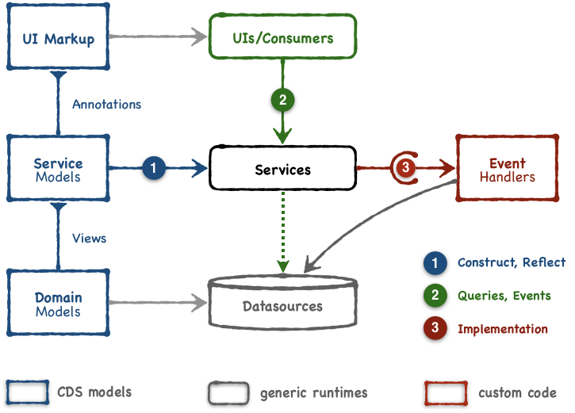

# Welcome to CAP Samples for Java

Welcome to the bookshop-java project. It demonstrates how to build simple applications on the Java SDK for the [SAP Cloud Application Programming Model](https://cap.cloud.sap) (CAP). The applications in this project enable browsing books, managing books and managing orders.


## Outline

- [Welcome to CAP Samples for Java](#welcome-to-cap-samples-for-java)
  - [Outline](#outline)
- [Overview](#overview)
  - [Demonstrated Features](#demonstrated-features)
- [Getting Started](#getting-started)
  - [Prerequisites](#prerequisites)
  - [Importing the Project in Eclipse](#importing-the-project-in-eclipse)
  - [Building and Running](#building-and-running)
  - [Database Setup and Spring Profiles](#database-setup-and-spring-profiles)
  - [Using a File-Based SQLite Database](#using-a-file-based-sqlite-database)
- [Get Support](#get-support)
- [License](#license)

# Overview

The goal of the bookshop-java project is to provide fully-functional applications including **domain models** and **data persistency**, **OData services** and **application logic**, and **SAP Fiori frontends**.



The **Application Framework**, or runtime for the application, is Spring Boot. Although a Java CAP application is not required to build on Spring Boot, it is the first choice of framework, as it is seamlessly integrated.

The **Domain models** are defined using [CDS entity definitions](https://cap.cloud.sap/docs/cds/cdl#entity-and-type-definitions).

For local **Data persistency** an in-memory SQLite or file-based SQLite database can be used. For cloud Data persistency, once deployed to SAP Cloud Platform, SAP HANA can be used.

**Services** are defined using [CDS Service Models](https://cap.cloud.sap/docs/cds/cdl#services). The **OData V4 Protocol Adapter** translate the CDS service models into corresponding OData schemas and maps the incoming OData requests to the corresponding CDS services.

Although CAP provides Generic **Event handlers** to serve most CRUD requests out-of-the-box, it is possible to add business logic via [Custom Event Handlers](https://cap.cloud.sap/docs/get-started/in-a-nutshell#adding-custom-logic).

A Fiori UI is added using predefined SAP Fiori elements templates. **[Fiori annotations](https://cap.cloud.sap/docs/guides/fiori/#fiori-annotations)** add information to the service definitions, on how to render the data.

## Demonstrated Features

Framework/Infrastructure related Features

- [Application configuration](https://cap.cloud.sap/docs/java/development#application-configuration) for spring and cds using [application.yaml](srv/src/main/resources/application.yaml)
- [Mocking users](/srv/src/main/resources/application.yaml) for local development
- [Authentication & Authorization](https://cap.cloud.sap/docs/java/advanced#security) (including user-specific restrictions with `@restrict` in the [Admin Service](/srv/admin-service.cds))
- [Localization](https://cap.cloud.sap/docs/guides/i18n) for [English](app/_i18n/i18n.properties) and [German](app/_i18n/i18n_de.properties) language

Domain Model related Features

- [CDS Query Language with a Static CDS Model](https://cap.cloud.sap/docs/java/advanced#staticmodel) in the [Admin Service](srv/src/main/java/my/bookshop/handlers/AdminServiceHandler.java)
- Use of [Aspects](https://cap.cloud.sap/docs/cds/cdl#aspects) in the Model Definition such as the [reuse of Aspects](https://cap.cloud.sap/docs/cds/common#common-reuse-aspects) in [Books](db/schema.cds)

Service Model related Features

- [Custom event handlers](https://cap.cloud.sap/docs/java/provisioning-api) such as the [Custom business logic for the Admin Service](srv/src/main/java/my/bookshop/handlers/AdminServiceHandler.java)
- [Value Help](https://cap.cloud.sap/docs/cds/annotations#odata) for [Books](app/orders/fiori-service.cds) and [Authors](app/common.cds)

UI related Features

- Support for SAP [Fiori Elements](https://cap.cloud.sap/docs/guides/fiori/#fiori-draft-support)
- [Fiori Draft based Editing](https://cap.cloud.sap/docs/guides/fiori/#fiori-draft-support) for [Books and Authors](srv/admin-service.cds)


# Getting Started

The following sections describe how to set up, build and run the project.

## Prerequisites

Make sure you have setup a development environment (that means, you have installed the CDS Compiler, Java and Apache Maven) [as described here](https://cap.cloud.sap/docs/java/getting-started).

## Importing the Project in Eclipse

1.  Clone the project:
```
  git clone https://github.com/SAP-samples/cloud-cap-samples-java.git
```
2.  Import the project using **File > Import > Existing Maven Projects**.

    Now, you should see the projects **bookshop** and **bookshop-parent** in the project/package explorer view.
3.  In Project Explorer, change the property "Package Presentation" from "Flat" to "Hierarchical" for better understanding.

## Building and Running

1.  To **compile** the project, right-click the file `pom.xml` in the `bookshop-parent` project root folder and select
**Run as** > **Maven build**.

    In the following dialog, enter the string `clean install` into the field labeled with "Goals" and click "Run".

    Note: This step also compiles the CDS artifacts, thus repeat this once you made changes to the CDS model. This step also generates source files, therefore refresh the "bookshop" project in your IDE.

2.  To **run** the application, right-click the `bookshop` project root in the Package Explorer and select **Run as** > **Spring Boot App** (make sure you have [Spring Tools 4 installed](https://marketplace.eclipse.org/content/spring-tools-4-aka-spring-tool-suite-4)).

    This step creates a default Run Configuration named `Bookshop - Application` and starts the application afterwards. To go on with the next step, stop the application again.

3.  Then, set the default working directory by editing your Run Configuration via **Run** > **Run Configurations** > **Bookshop - Application**. On the tab **Arguments** change the default **Working Directory** to:

	```${workspace_loc:bookshop-parent}```

	Afterwards, click **Run**. This step starts the applications `main` method located in `src/main/java/my/bookshop/Application.java`.

4.  Use the following links in the browser to check if everything works fine:

    <http://localhost:8080/>: This should show the automatically generated index page of served paths.
    <http://localhost:8080/fiori.html>: This is the actual bookshop application UI

    You'll start with an empty stock of books as this procedure starts the bookshop application with an empty in-memory sqlite database.

    Two mock users are defined for local development:
    - User: `user`, password: `user` to browse books
    - User: `admin`, password: `admin` to manage books and orders

## Database Setup and Spring Profiles

The application comes with three predefined profiles: `default`, `sqlite` and `cloud` (see `src/main/resources/application.yaml`).

- The `default` profile specifies to use an in-memory SQLite database.
  The in-memory database is set up automatically during startup of the application.
  However, example data from CSV files are not yet automatically imported, therefore some content needs to be created via OData V4 API requests.

- The `sqlite` profile specifies to use a persistent SQLite database from root directory of the project.
  This database needs to be created first, to ensure it is initialized with the correct schema and with the CSV-based example data.
  To initialize the database, simply run `cds deploy` from the project's root directory. Repeat this step, once you make changes to the CDS model.

- When deploying the application to the CloudFoundry, the CF Java Buildpack automatically configures the `cloud` Spring profile.
  This profile does not specify any datasource location. In that case CAP Java can automatically detect HANA service bindings available in the environment.

## Using a File-Based SQLite Database

To switch from the default in-memory SQLite database to a file-based SQLite database in this sample application perform the following steps:

1.  Deploy the example data stored in .csv files in the folder ``db/data`` to a file-based SQLite database by executing the command-line utility

    ```cds deploy```

    from your project root folder.

2.  Edit your Run Configuration via **Run** > **Run Configurations...** and select enter the **Profile** `sqlite` on tab **Spring** and click **Run**.

# Get Support

Check out the documentation at https://cap.cloud.sap.
In case you find a bug or need support, please [open an issue in here](https://github.com/SAP-samples/cloud-cap-samples-java/issues/new).

# License

Copyright (c) 2020 SAP SE or an SAP affiliate company. All rights reserved. This file is licensed under the Apache Software License, version 2.0 except as noted otherwise in the [LICENSE](LICENSE) file.
